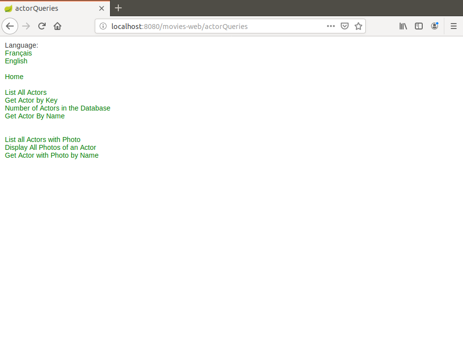
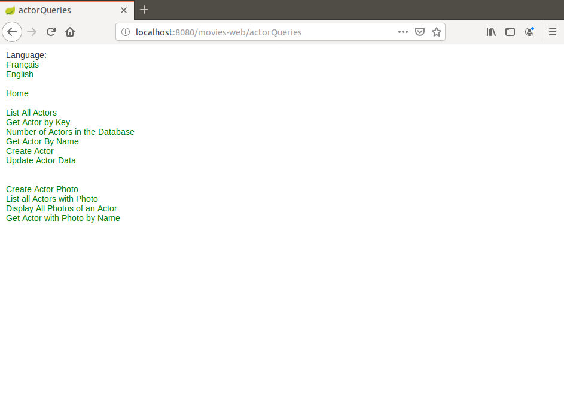
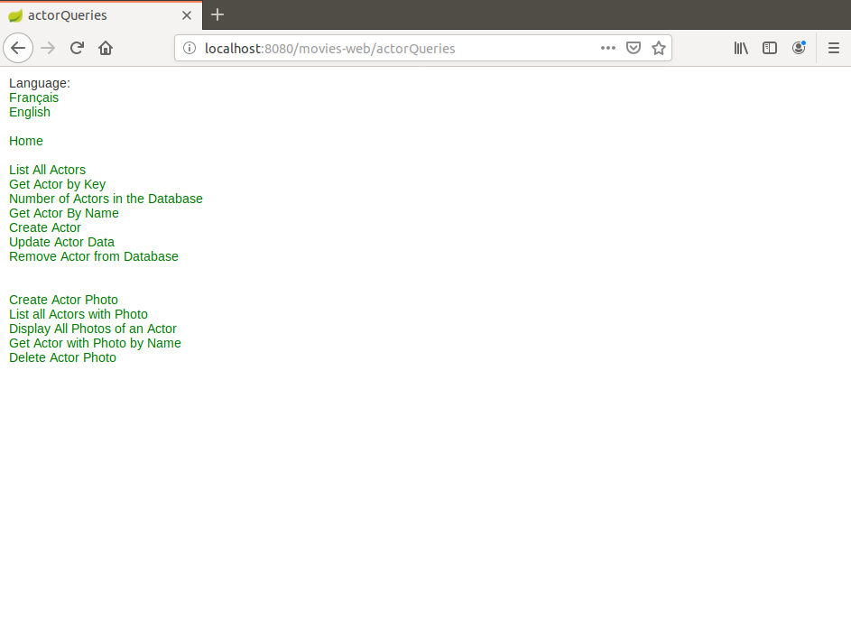

# MoviesWebSecurity
I present here a Spring Boot based Web site demo with CrudRepository support and Spring Security.

This is a demonstration project on Spring Boot development. It requires:

A recent version of MySQL server (I used 8.0.16). 
A recent version of Maven (I used 3.6.0)

The file moviesDBSecu.sql was used to generate and populate the MySql database used in this project.

For the basic JDBC version of this project see the repository:

https://github.com/dubersfeld/MoviesWebJDBC

For the JPQL version of this project see the repository:

https://github.com/dubersfeld/MoviesWebJPQL

For the Criteria version of this project see the repository:

https://github.com/dubersfeld/MoviesWebCriteria

For the CrudRepository version of this project see the repository:

https://github.com/dubersfeld/MoviesWebCrud

To launch this demo run this command in project directory: `mvn spring-boot:run`.

When the application has started open a browser and hit URL: `localhost:8080/movies-web`

Note on authorities:

I have predefined 4 authorities: VIEW, CREATE, UPDATE, DELETE

The source file moviesDBSecu.sql declares 5 users with different authorities and passwords listed below:

Username        Password        Authorities

Carol           s1a2t3o4r       VIEW

Albert          a5r6e7p8o       VIEW

Werner          t4e3n2e1t       VIEW

Alice           o8p7e6r5a       VIEW, CREATE, UPDATE

Richard         r1o2t3a4s       VIEW, CREATE, UPDATE, DELETE

Moreover any new user can register and be granted the only VIEW authority. All menus are customized to display only the requests that are allowed to the actual user. This feature requires the Maven dependency:
```
<dependency>
    <groupId>org.thymeleaf.extras</groupId>
    <artifactId>thymeleaf-extras-springsecurity5</artifactId>
</dependency>
```
Here are some screen shots of the same page seen by users with different authorities:

VIEW only:


VIEW, CREATE, UPDATE


VIEW, CREATE, UPDATE, DELETE



Dominique Ubersfeld, Cachan, France 
